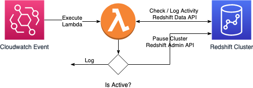

## Overview

Customers who use Redshift on-demand may need a mechanism to pause their Redshift cluster when it’s not in use.  This project shows how you can use lambda to auto-pause your Redshift Cluster.  It will check for user activity using a user-defined interval and if there is no activity, the cluster will automatically paused.  

## Architecture

This solution leverages the following components: 

1. Cloudwatch Event to schedule the execution of the Lambda function.
2. A Lambda function which:
    1. Connects to Amazon Redshift via the Redshift Data API and checks if there has been any activity since the last execution and logs the result in the *autopause_log* table.
    2. If there was activity, it exits.
    3. If there was no activity, it uses the Redshift Admin API to execute the *pause_cluster* command.

## Cloud Formation

You can deploy this solution using a Cloud Formation [Template](RedshiftAutoPause.yml). Which will expect the following inputs:  

* Cluster - The Amazon Redshift cluster name.
* Database - The name of the database which will be used in the connection.
* User - The user which will be used to check for activity.
* Schedule - The frequency to check for activity. E.g. rate(1 hour)
* Topic - (Optional) If populated, will send a message to the SNS Topic when the cluster is paused.
* Email - (Optional) If populated, will create a new SNS topic using the above Topic Name along with a subscription using this Email address.

> For newly created topic/email, confirm the email subscription in order to receive notifications.

The template will create the following objects:

* [Log Table](autopause_log.sql) - this will be created within the Redshift Cluster and will log execution and entries where the cluster was paused.
* [Lambda Function](lambda_handler.py) - the function which will orchestrate the logic
* [IAM Role](iam_role_policy.json) - the role needed by the lambda function to execute, log, and perform Redshift functions.  The permissions for this role will be scoped to only provide access to the Redshift Cluster provided in the CFN template. The role will include a [trust relationship](iam_role_trust_relationship.json) to assume allowing lambda to assume this role. 
* Cloudwatch Event Rule - the component which will schedule the activity checks.  This rule will pass in the parameters specified in the CFN template.
